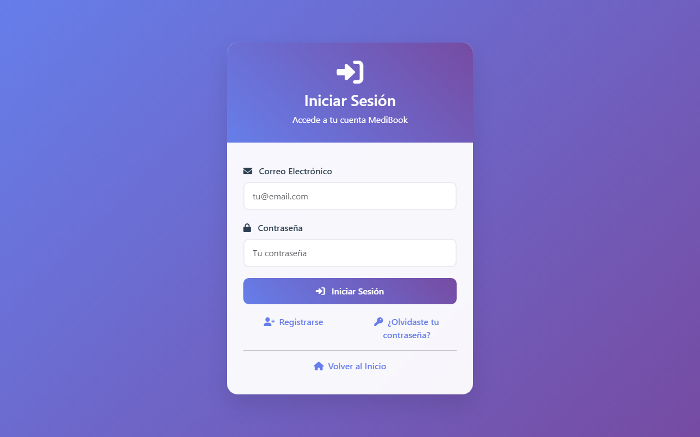
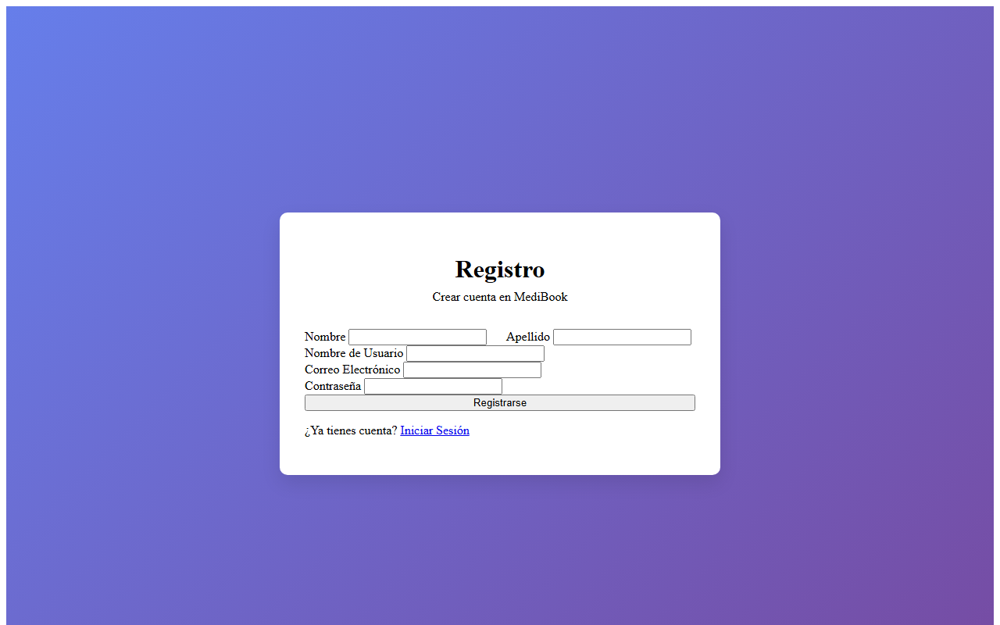
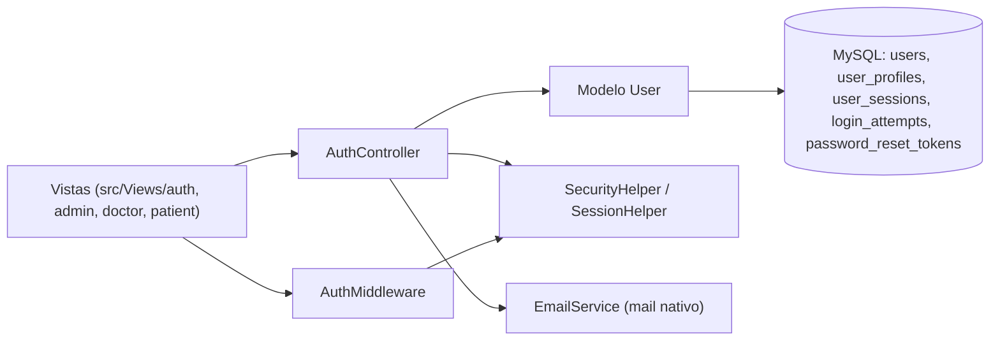

<div align="center">
  
  <h1>MediBook</h1>
  <p><b>Base en PHP puro para un sistema de citas médicas: hoy, autenticación segura con paneles por rol.</b></p>

  
  
  
  
  
  <br />
  <a href="https://github.com/Luiss2080/MediBook/actions/workflows/ci.yml"></a>

  <p>
    <a href="#-inicio-rápido">Inicio rápido</a> ·
    <a href="#-características">Características</a> ·
    <a href="#-arquitectura">Arquitectura</a> ·
    <a href="#-pruebas">Pruebas</a> ·
    <a href="#-lo-que-todavía-no-existe">Limitaciones</a>
  </p>
</div>

MediBook es la **base** (MVC ligero, PDO + MySQL, sin framework) de un futuro sistema de gestión de citas
para consultorios. Lo que **sí** hace hoy: registro, login, recuperación de contraseña y tres paneles
(administrador, doctor, paciente) con protecciones de seguridad reales. Lo que **no** hace todavía:
reservar ni gestionar citas, ni CRUD de médicos/pacientes, ni notificaciones, ni reportes (ver
[Lo que todavía no existe](#-lo-que-todavía-no-existe)).

## 🎬 Vista rápida

Capturas reales de la aplicación corriendo en local:

| Inicio de sesión | Registro |
|---|---|
|  |  |

## ✨ Características

| Característica | Detalle |
|---|---|
| 🔐 Autenticación | Registro, login y logout con `password_hash` (bcrypt). Los registros nuevos siempre son `patient`. |
| 👥 Tres roles | `admin`, `doctor` y `patient`, cada uno redirigido a su propio dashboard. |
| 🛡️ CSRF | Token de un solo uso por formulario en login, registro, "olvidé mi contraseña" y "restablecer contraseña". |
| 🚫 Fuerza bruta | Bloqueo tras 5 intentos fallidos en 15 minutos (tabla `login_attempts`). |
| 🔁 Recuperación de contraseña | Token de un solo uso con expiración de 1 hora; se envía solo por correo, nunca en la respuesta HTTP. |
| 🍪 Sesiones | Cookie configurable, `HttpOnly`, `SameSite=Lax`, `Secure` automático bajo HTTPS, ID regenerado tras login. |
| 🗄️ Datos | PDO con consultas preparadas; migraciones y seeds SQL versionados, ejecutables con `scripts/migrate.php`. |
| ✅ Calidad | 24 tests PHPUnit y CI en GitHub Actions (lint de sintaxis + tests contra MySQL 8, PHP 8.1 y 8.3). |

## 🏗️ Arquitectura

Es un MVC artesanal: cada pantalla es un archivo PHP en `src/Views` que se sirve directamente (no hay router).



<details>
<summary>📁 Estructura de carpetas</summary>

```
config/            Connection (PDO singleton), app, database, mail, constants
src/Controllers/   AuthController (implementado); el resto son archivos vacíos
src/Models/        User (implementado); Appointment, Doctor, Patient, Notification vacíos
src/Services/      EmailService (implementado); el resto vacíos
src/Helpers/       SecurityHelper, SessionHelper (implementados); DateHelper, FileHelper vacíos
src/Middleware/    AuthMiddleware (implementado); Csrf/Role/TempAuth vacíos
src/Views/         auth, admin, doctor, patient, layouts, components, Home
src/Database/      migrations/ (5) y Seeds/ (5)
scripts/           migrate.php, backup.sh, deploy.sh
tests/             Unit (SecurityHelper) e Integration (flujo de autenticación)
```

</details>

## 🚀 Inicio rápido

| Requisito | Versión |
|---|---|
| PHP | 8.1+ con `pdo` y `pdo_mysql` |
| MySQL | 8 o compatible |
| Composer | 2.x |

```bash
git clone https://github.com/Luiss2080/MediBook.git
cd MediBook
composer install
cp .env.example .env            # ajusta DB_* a tu MySQL local
mysql -u root -e "CREATE DATABASE medibook CHARACTER SET utf8mb4 COLLATE utf8mb4_unicode_ci"
php scripts/migrate.php         # migraciones + usuarios de demostración
php -S localhost:8000           # desde la RAÍZ del proyecto (public/ solo tiene assets)
```

Rutas útiles (cada pantalla es un archivo PHP):

- `http://localhost:8000/` — bienvenida (redirige al dashboard si ya hay sesión).
- `http://localhost:8000/src/Views/auth/login.php` y `.../register.php`.

> ⚠️ `migrate.php` siembra `admin@medibook.com`, `doctor@medibook.com` y `patient@medibook.com`, los tres con
> la contraseña `password123`, y la página de bienvenida las muestra en pantalla. Son solo para desarrollo:
> no uses estos seeds en una base de datos real.

<details>
<summary>⚙️ Variables de entorno principales (.env.example)</summary>

| Variable | Uso |
|---|---|
| `DB_HOST`, `DB_PORT`, `DB_DATABASE`, `DB_USERNAME`, `DB_PASSWORD` | Conexión MySQL |
| `APP_URL`, `APP_ENV`, `APP_DEBUG`, `APP_TIMEZONE` | Aplicación |
| `SESSION_LIFETIME`, `SESSION_SECURE` | Sesión y cookie |
| `MAIL_*` | Configuración de correo (ejemplo con SMTP; el envío actual usa `mail()` de PHP) |

El resto de variables del archivo (subidas, notificaciones, caché, logs) están declaradas para módulos futuros.

</details>

## 🧪 Pruebas

Hay **24 tests** (8 unitarios de `SecurityHelper` y 11 de integración de autenticación, más casos de
data provider), verificados: `OK (24 tests, 38 assertions)`. Los de integración usan una base MySQL real y
desechable, nunca la de desarrollo.

```bash
mysql -u root -e "CREATE DATABASE medibook_test CHARACTER SET utf8mb4 COLLATE utf8mb4_unicode_ci"
composer test
```

Cubren: CSRF de un solo uso, contraseña fuerte, login correcto/incorrecto/usuario inactivo, bloqueo por 5
intentos, ciclo de vida y expiración del token de recuperación y detección de correo duplicado.

## 🔒 Seguridad

- Contraseñas con bcrypt, consultas preparadas, CSRF de un solo uso, bloqueo por intentos, token de
  recuperación de un solo uso con expiración y sesión endurecida (ver Características).
- `.env` está ignorado por git; usa siempre credenciales propias.
- Los usuarios sembrados y su contraseña son públicos (están en este repositorio y en la pantalla de bienvenida).

## 🚧 Lo que todavía no existe

- **Citas**: no hay tabla de citas ni reserva/gestión. `AppointmentController`, `Appointment`,
  `AppointmentService` y las vistas de citas del paciente/admin son archivos vacíos.
- CRUD de médicos y pacientes, notificaciones, reportes y exportación a PDF/Excel: archivos vacíos.
  `dompdf`, `phpspreadsheet` y `phpmailer` están en `composer.json` pero ningún código los usa
  (el correo de recuperación se envía con `mail()` nativo).
- Los dashboards muestran contenido de demostración, no datos reales de citas.
- No hay router ni punto de entrada único; `CsrfMiddleware`, `RoleMiddleware` y `TempAuthMiddleware` están vacíos.
- `docs/API.md`, `docs/DATABASE.md` y `docs/SETUP.md` están vacíos.
- El seed `003` de perfiles asume IDs de usuario fijos (1 a 5); sobre una base con IDs distintos falla por clave foránea.
- `package.json` declara Webpack, pero no hay proceso de build (JS/CSS se sirven tal cual; Bootstrap y Font Awesome vienen de CDN).

## 📄 Licencia

MIT — ver [LICENSE](LICENSE).

<div align="center">
  <sub>Hecho por Luiss2080 · PHP, MySQL y mucho café</sub>
</div>
